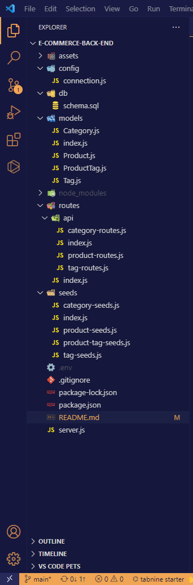
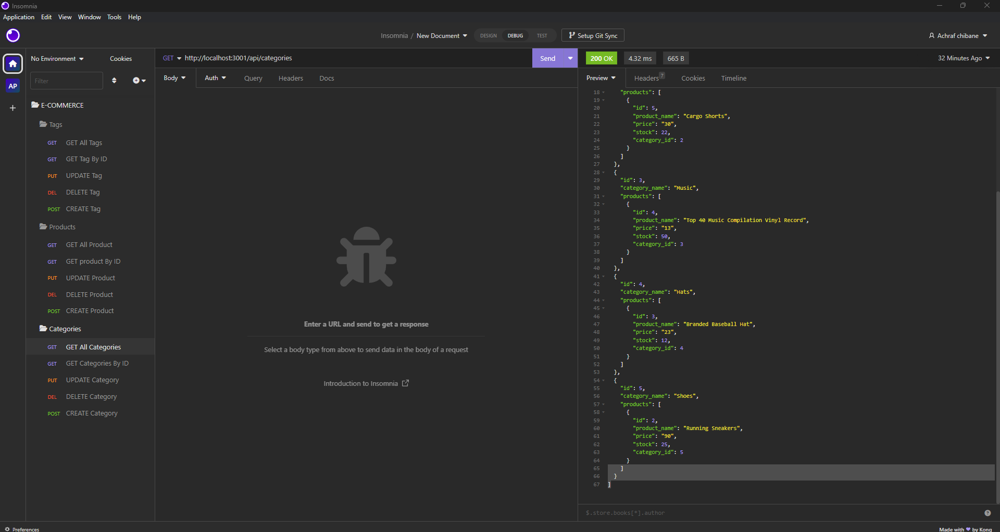
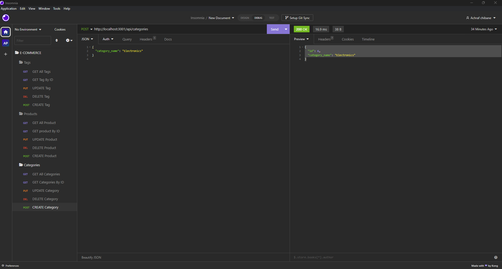
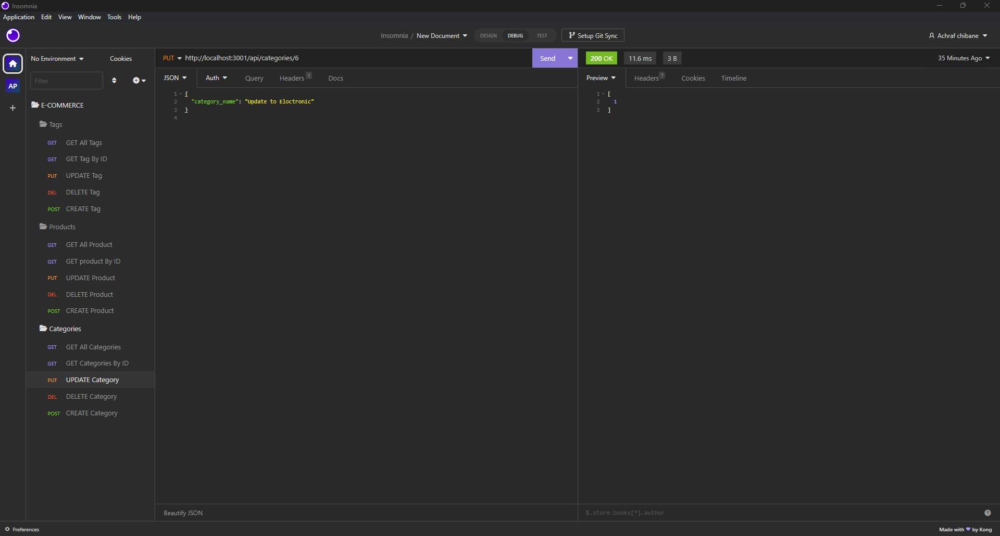
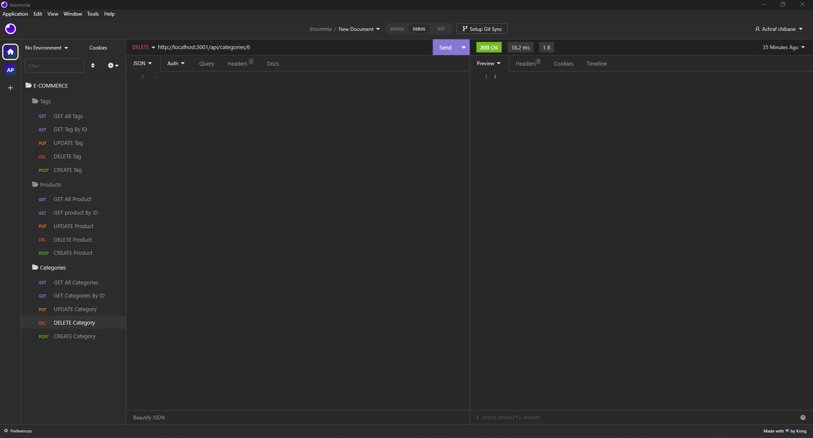

# E-commerce-Back-End

## Table of Contents

- [Description](#description)
- [Screenshots](#screenshots)
- [Installation](#installation)
- [Usage and DEMO](#usage-and-demogit)
- [User Story](#user-story)
- [Acceptance Criteria](#acceptance-criteria)
- [Contributing](#contributing)
- [Tests](#tests)
- [Credits](#credits)
- [Questions](#questions)

## Description

Internet retail, also known as e-commerce, is the largest sector of the electronics industry, 
having generated an estimated US$29 trillion in 2017 (Source: United Nations Conference on Trade and Development).
E-commerce platforms like Shopify and WooCommerce provide a suite of services to businesses of all sizes. 
Due to the prevalence of these platforms, developers should understand the fundamental architecture of e-commerce sites.

## Screenshots
## Folder Structure <br>



## Screenshot of the application






## The first animation shows GET routes to return all categories, all products, and all tags being tested in Insomnia Core:

## The second animation shows GET routes to return a single category, a single product, and a single tag being tested in Insomnia Core:

## The final animation shows the POST, PUT, and DELETE routes for categories being tested in Insomnia Core:


## Installation
To install the project follow these steps:
```
1- Clone the application from GitHub with:
   git clone [clone link from GitHub]
2- From the root folder, install the dependencies with:
    - npm install
3- Run the following command: 
    - mysql -u root -p
    - source db/schema.sql
    - npm run seed
    - npm start
   
4- go to insomnia and run : localhost:3001/api/products
```

## Usage and DEMO.

Using ORM in e-commerce back ends enables developers to work with database objects in a more intuitive, object-oriented manner.
This allows for easy manipulation of e-commerce data, such as products, categories, customers, orders, and transactions, without writing complex SQL queries. 
You can also watch a video demonstration of the application [Click Here](https://drive.google.com/file/d/1lRZbMy1HBfEviQD6mfXQb_gTqgphk7DA/view).

## User Story
```
AS A manager at an internet retail company
I WANT a back end for my e-commerce website that uses the latest technologies
SO THAT my company can compete with other e-commerce companies
```
## Acceptance Criteria
```
GIVEN a functional Express.js API
WHEN I add my database name, MySQL username, and MySQL password to an environment variable file
THEN I am able to connect to a database using Sequelize
WHEN I enter schema and seed commands
THEN a development database is created and is seeded with test data
WHEN I enter the command to invoke the application
THEN my server is started and the Sequelize models are synced to the MySQL database
WHEN I open API GET routes in Insomnia Core for categories, products, or tags
THEN the data for each of these routes is displayed in a formatted JSON
WHEN I test API POST, PUT, and DELETE routes in Insomnia Core
THEN I am able to successfully create, update, and delete data in my database
```
## Contributing
Pull requests are welcome, please open an issue first to discuss what you would like to change. thank you

## Tests
This application has been tested by the creator and it works fine.<br>
this application has been uploaded to github: https://github.com/Ash0422/E-commerce-Back-End <br>

## Credits

- Our class record. 

## Questions
For any additional questions, please contact me by [EMAIL](chibane.tkd04@gmail.com). or visit my GitHub profile at [GITHUB](https://github.com/Ash0422).


